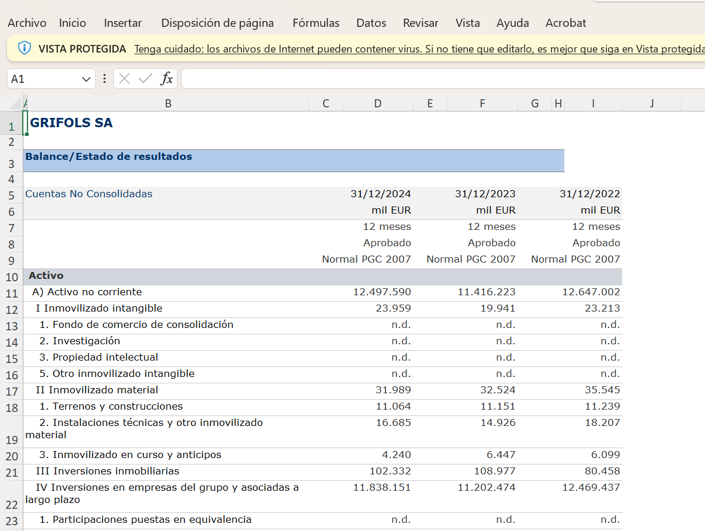
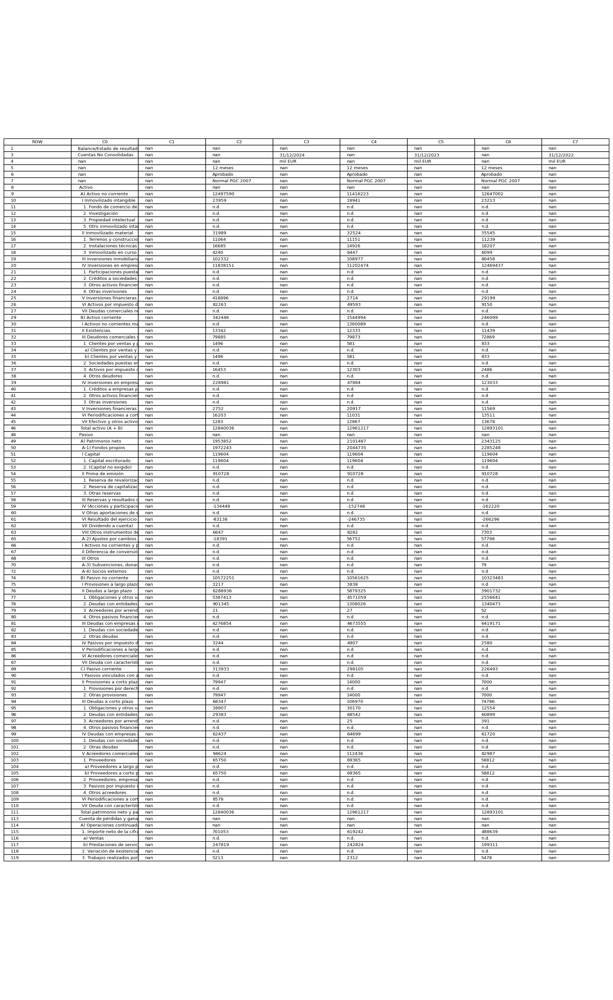
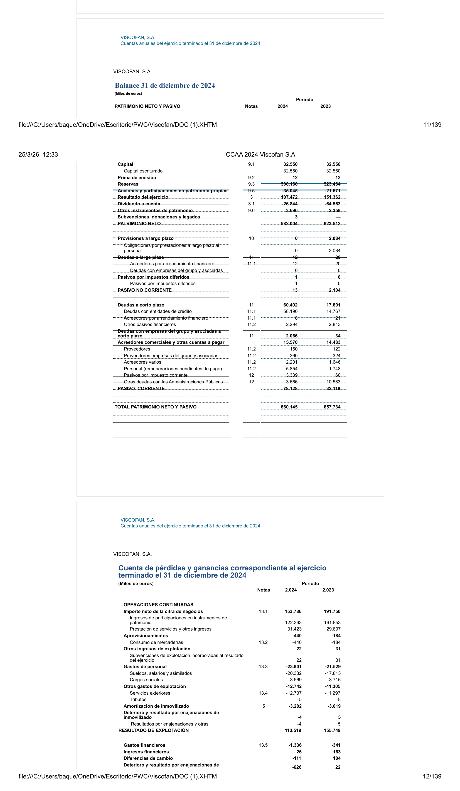

# Extracción automática de estados financieros heterogéneos para scoring crediticio

Este repositorio contiene los **experimentos de extracción de partidas contables** desarrollados como parte del TFM *"Diseño de automatización de seguimiento crediticio bancario"* (CUNEF Universidad, 2026).

---

## Contexto del proyecto

El TFM diseña e implementa un sistema de generación automatizada de informes de seguimiento crediticio bancario, construido íntegramente sobre herramientas de código abierto. El pipeline principal está orquestado en **n8n** (workflow visual low-code desplegado en Docker) y combina lógica determinista en Python con llamadas a LLMs vía API de Groq para sintetizar los distintos bloques del informe.

Uno de los bloques centrales del informe es el **análisis económico-financiero**, que calcula 22 ratios agrupados en cinco categorías (solvencia, cobertura, liquidez, rentabilidad y eficiencia operativa) y los compara contra un benchmark sectorial para obtener un scoring crediticio del acreditado. En el pipeline principal este módulo opera sobre un Excel con estructura fija exportado de SABI.

### El problema que resuelven estos experimentos

En la práctica, los estados financieros que llegan a un analista de crédito no siempre tienen el formato exacto de una exportación de SABI. Un cliente puede enviar:

- Un **Excel** con estructura diferente: layout transpuesto, multi-hoja, con columnas de variación interanual intercaladas, con cabeceras en inglés o con celdas combinadas que pandas desplaza al leer.
- Una **imagen** (PNG, JPEG): exportación visual de un Excel, captura de pantalla o fotografía de un documento impreso.
- Un **PDF**: cuentas anuales depositadas en la CNMV, memoria del Registro Mercantil o documento enviado directamente por la empresa, con tablas que se cortan entre páginas y ruido OCR.

Este repositorio documenta el diseño y evaluación de un pipeline de extracción capaz de funcionar correctamente con independencia del formato de entrada, produciendo en todos los casos el mismo DataFrame de 22 partidas contables que alimenta el cálculo de ratios.

---

## Workflow del pipeline principal en n8n

El siguiente diagrama muestra el flujo completo del sistema de generación de informes en n8n. Los experimentos de este repositorio corresponden al **módulo de análisis económico-financiero** (bloque central del workflow), que es el que se alimenta de los estados financieros del acreditado.

> 📌 *El pipeline de n8n orquesta de forma visual los cinco módulos del informe: identificación del acreditado, CIRBE, análisis económico-financiero, triggers de clasificación y pérdida esperada. Los notebooks de este repositorio son la exploración en Python del módulo de extracción de estados financieros, que en el pipeline principal opera sobre un formato fijo.*


---

## Estructura del repositorio

```
📄 excel_pipeline.ipynb
📄 imagen_pipeline.ipynb
📄 pdf_pipeline.ipynb
📄 experimentos de efectos de recortes en la...ipynb
📄 README.md

📂 inputs/
   ├── excels/
   │    ├── balance_pyg.xlsx               # Balance + PyG de Grifols (SABI) — input del pipeline Excel
   │    ├── balance descompuesto.xlsx       # Variante multi-hoja
   │    ├── excel transpuesto.xlsx          # Variante con layout horizontal
   │    └── imagen_excel.png               # Captura del Excel original en Excel
   ├── imagenes/
   │    ├── excel_balance.png              # Balance de Grifols comprimido en imagen — input del pipeline imagen
   │    └── excel_pyg.png                  # PyG de Grifols en imagen
   ├── pdf_padado_imagen/
   │    ├── pagina_001.png                 # Página 1 del PDF de Viscofan (activo)
   │    ├── pagina_002.png                 # Página 2 (pasivo + inicio PyG) — usada en el README
   │    └── pagina_003.png                 # Página 3 (continuación PyG)
   └── workflow n8n completo.png           # Diagrama completo del workflow en n8n
```

---

## Inputs de los experimentos

Los tres pipelines trabajan sobre estados financieros reales de empresas cotizadas, disponibles públicamente:

### Excel — Grifols, S.A. (exportación SABI)
Balance consolidado y cuenta de pérdidas y ganancias para los ejercicios 2022, 2023 y 2024. Exportación estándar de SABI con celdas combinadas en la cabecera y columnas de valores desplazadas al leer con pandas.



---

### Imagen — Grifols, S.A. (exportación visual del Excel)
La misma información del Excel comprimida en un único plano visual. Caso extremo de densidad: balance completo y PyG de tres ejercicios en una sola imagen PNG.



---

### PDF — Viscofan, S.A. (cuentas anuales CNMV 2024)
Cuentas anuales individuales descargadas directamente de la CNMV. Tablas partidas entre páginas, líneas de tabla superpuestas con valores numéricos, tipografías compactas que el OCR concatena sin espacios.



---

## Tecnologías utilizadas

| Herramienta | Rol en el pipeline |
|---|---|
| **Python + pandas** | Lógica de extracción y cálculo de ratios (100% determinista) |
| **Docling** (IBM) | Extracción estructurada de tablas desde imágenes y PDFs mediante OCR (RapidOCR) y detección de layout |
| **Groq API** | Inferencia de LLMs en plan gratuito con latencia baja (TPU) |
| **openai/gpt-oss-120b** | Detección de layout del Excel y selección de partidas por índice posicional |
| **llama-3.3-70b-versatile** | Selección de partidas en el pipeline Excel |
| **meta/llama-4-scout-17b** | Extracción de fechas desde cabecera de imagen (LLM multimodal) |
| **python-dotenv** | Gestión de credenciales sin hardcodeo |
| **rapidfuzz** | Fuzzy matching explorado como alternativa (descartado — ver `pdf_pipeline.ipynb`) |

### Sobre Docling

[Docling](https://github.com/DS4SD/docling) es una librería open-source de IBM diseñada para la extracción estructurada de contenido de documentos. Internamente combina:
- **Detección de layout** mediante modelos de visión por computador para identificar regiones de tabla, texto y figuras.
- **OCR** con RapidOCR para el reconocimiento de caracteres en imágenes.
- **Reconstrucción tabular** para exportar las tablas detectadas como DataFrames de pandas con filas y columnas correctamente alineadas.

En los experimentos de este repositorio, Docling es la pieza que transforma imágenes y páginas de PDF en DataFrames tabulares sobre los que el resto del pipeline puede operar de forma determinista.

---

## Enfoque de extracción

El pipeline sigue el mismo esquema de 5 pasos para los tres formatos de entrada, con una fase de preprocesado específica para imagen y PDF:

```
Input (Excel / Imagen / PDF)
        │
        ├─ [Solo imagen/PDF] Preprocesado visual
        │    ├─ Imagen:  recorte en N trozos con overlap 5%  → Docling
        │    └─ PDF:     conversión página a PNG             → Docling
        │
        ├─ Paso 1: Detección de layout          ← LLM (muestra serializada)
        │           ¿Cómo está organizado el fichero?
        │           Columnas de conceptos, columnas de valores, períodos.
        │
        ├─ Paso 2: DataFrame de conceptos       ← Python determinista
        │           Extracción de todas las partidas con sus valores por período.
        │
        ├─ Paso 3: Selección de 22 partidas     ← LLM (índice posicional completo)
        │           ¿Cuál de todas las partidas es "patrimonio_neto"?
        │           ¿Cuál es "deudas con entidades de crédito a LP" vs "a CP"?
        │
        ├─ Paso 4: Extracción de valores        ← Python determinista
        │           Lookup posicional en el DataFrame.
        │
        └─ Paso 5: Cálculo de 22 ratios         ← Python determinista
```

**Principio de diseño:** el LLM interviene únicamente en los dos pasos que requieren razonamiento sobre estructura y nomenclatura (layout y selección de partidas). Todo lo que puede calcularse de forma exacta se calcula con Python. Esto garantiza que los valores numéricos que alimentan el scoring sean siempre deterministas y trazables.

### Por qué índice posicional y no embeddings ni fuzzy matching

El paso de selección de partidas es el más delicado del pipeline. Se evaluaron tres enfoques (documentados en detalle en `experimentos_recortes.ipynb` y en la memoria del TFM):

- **Embeddings** (six modelos probados, hasta 560M parámetros): fallan sistemáticamente con partidas de nombre similar en secciones distintas del balance y con la estructura acumulativa de la PyG.
- **Fuzzy matching** (rapidfuzz, ensemble WRatio + token_sort + partial): resuelve la mayoría de casos pero no puede distinguir partidas con nombre idéntico en secciones distintas (ej: "Deudas con entidades de crédito" aparece igual en LP y CP).
- **LLM con índice posicional**: recibe la lista completa de partidas con su número de fila y puede razonar por proximidad jerárquica para resolver todos los casos ambiguos, incluyendo partidas duplicadas, denominaciones en inglés y ruido OCR. Es el enfoque adoptado en el pipeline final.

---

## Notebooks

### [`excel_pipeline.ipynb`](notebooks/excel_pipeline.ipynb)
Pipeline completo para ficheros Excel con estados financieros en cualquier formato: vertical, horizontal, multi-hoja, con celdas combinadas, en español o inglés. Empresa de prueba: **Grifols, S.A.** (3 ejercicios, exportación SABI).

### [`imagen_pipeline.ipynb`](notebooks/imagen_pipeline.ipynb)
Pipeline para imágenes PNG/JPEG. Incluye la estrategia de segmentación con overlap y la variante de detección de layout en llamada LLM unificada (reducción del 74% en tokens respecto a llamadas individuales por trozo). Empresa de prueba: **Grifols, S.A.**

### [`pdf_pipeline.ipynb`](notebooks/pdf_pipeline.ipynb)
Pipeline para PDFs de cuentas anuales. Documenta el enfoque descartado (Docling nativo sobre PDF) y el adoptado (conversión página a imagen). Incluye la corrección de signo en la amortización necesaria cuando la PyG viene con notación contable de gasto negativo. Empresa de prueba: **Viscofan, S.A.** (cuentas CNMV 2024).

### [`experimentos_recortes.ipynb`](notebooks/experimentos_recortes.ipynb)
Experimento comparativo que justifica la estrategia de segmentación de imágenes. Evalúa Docling con 0, 2, 3 y 4 recortes horizontales frente a visión directa con `llama-4-scout-17b` bajo las mismas configuraciones. Resultado: Docling mejora progresivamente con más recortes; visión directa empeora y colapsa a partir de 2 recortes por truncado del JSON de salida.

---

## Resultados

| Input | Partidas correctas | Ratios exactos | Nota |
|---|:---:|:---:|---|
| Excel (Grifols) | 22/22 | 22/22 | Baseline |
| Imagen (Grifols) | 22/22 | 22/22 | Idéntico al Excel |
| PDF (Viscofan) | 22/22 | 20/22 | 2 ratios con error por ruido OCR en amortización |

Los dos ratios con diferencia en el PDF (ICR y margen EBITDA) se deben a que la amortización se extrae con un valor ligeramente distinto al real por las líneas superpuestas de la tabla en el documento fuente. El resto de partidas y ratios son exactos.

---

## Instalación

```bash
git clone https://github.com/tu-usuario/tfm-extraccion-estados-financieros
cd tfm-extraccion-estados-financieros
pip install -r requirements.txt
```

Crea un fichero `.env` en la raíz con tus API keys de Groq:

```
GROQ_API_KEY_1=gsk_...
GROQ_API_KEY_2=gsk_...
GROQ_API_KEY_3=gsk_...
```

> Las claves son gratuitas en [console.groq.com](https://console.groq.com). Se usan tres en rotación para respetar los límites RPM del plan gratuito (30 RPM por clave) cuando el pipeline hace llamadas consecutivas para varios trozos.

---

## Contexto académico

**TFM:** *Diseño de automatización de seguimiento crediticio bancario*  
**Máster:** Máster Universitario en Ciencia de Datos e Inteligencia Artificial — CUNEF Universidad  
**Autor:** David Plaza Jiménez  
**Director:** Juan Maroñas Molano  
**Colaboración:** PwC España  
**Fecha:** Mayo 2026
